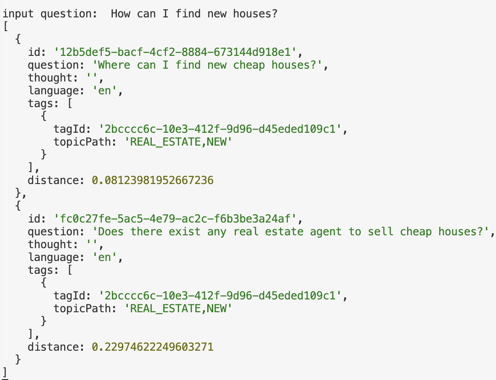

# 项目介绍

该项目旨在验证基于大语言模型代理RAG的问答系统。主要设计是，管理人员提前在后台存入*Knowledge*，*TAG*和*RELATION*（从*Knowledge*里面读取或者也可以手动输入）；以及*Question*和*Answer*， *Question*可以被人工关联到*TAG*。

每一个 Subtopic, 都会存储独立的*TAG*和*RELATION*（可以理解为不同的数据库表）。例如不同的Subtopic里面都有名为`Paris`的*TAG*，但是他们直接是完全没有关系的。可以理解为每一个Subtopic都拥有各自完全独立的*TAG*和*RELATION*

## 目的

该项目主要是为了探索结合[Graph RAG](https://github.com/microsoft/graphrag)来解决当前主流的RAG系统的固有缺陷

### 主流方案的不足

1. 当前RAG系统输入信息是固定的，主要集中于文档类信息。当前不支持动态编辑
2. 主流搜索引擎和问答平台主要是基于关键字搜索🔍，但缺陷在于针对多语言的支持比较差
3. 针对特定领域（TOPIC/SUBTOPIC）的自定义处理能力表较差，且不被重视

### 解决方案

1. 提供后台来实时输入和编辑*Knowledge*, *TAG* 以及 *RELATION*。每次处理用户提问时，都会直接从当前数据库中查找最新结果。
2. 在数据库查询和对查询后的结果进行筛选时，都采用基于[**Embedding**](https://cohere.com/llmu/sentence-word-embeddings)的语义搜索，可以实现跨语言搜索，摆脱传统的基于关键字搜搜的束缚
3. 对输入的问题进行**TOPIC/SUBTOPIC DETECTION**,在查找*TAG*以及*RELATION*时只在检测到的**SUBTOPIC**范围内进行筛选

## 如何处理用户输入（Question）

**Question** 是用户的提问，每一个*Question*都可以被分为简单和复杂。**目前只处理简单问题**。目前针对每个用户输入的提问，以下是简略的处理流程:
1. 使用LLM确定输入*Question*的*Subtopic*,注意一个问题里面可能会有复数个*Subtopic*， 比如问题`租房和买房哪个更好`涉及到了两个*Subtopic*
2. 计算出*Question*的**Embedding**，基于此道数据哭里面寻找拥有类似的**Embedding**的*Question*
  1. 如果没有找到，基于*Subtopic*查找出对应的Prompt使用LLM来提取该*Question*的**Intent**，可以理解为描述询问内容的短句可以代替输入的问题来到数据库里面寻找含有相近寓意的*TAG*
  2. 如果找到了，则需要使用**Reranker**服务，针对查找到的已经输入的*Question*，计算相似度并排序。挑选出相似度最高的*Question*，提取到它们的*TAG*
3. 收集到所有的*TAG*，并查找到该*TAG*对应的*RELATION*以及*Knowledge*
4. 到数据库里面查询所有筛选出的*Question*的*Answer*
5. 集合以上所有收集到的*Answer* *RELATION* *Knowledge*，都放入到Prompt里面输入给LLM来生成最后的回答

> 基于[**Embedding**](https://cohere.com/llmu/sentence-word-embeddings)的向量搜索是与所属的自然语言无关的。比如*书*，*BOOK*以及*LIVRE*拥有相近的**EMBEDDING**。但具体区别取决于使用的Embedding模型。本项目主要使用[text-embedding-3-small](https://platform.openai.com/docs/guides/embeddings/)。[Benchmark](https://huggingface.co/spaces/mteb/leaderboard)以及voyage-multilingual-2。前者较为便宜，可以对一些词汇和短语进行词嵌入计算，后者相对贵一些，主要是对句子进行词嵌入计算

## 模块

- **(SUB)TOPIC** 主题以及副主题,这些是有专门的配置文件事先定义的
- **Knowledge** 知识点，可以简单理解为文本，用人工手动输入。可以使用大模型来提取TAG和Relation。每个Knowledge必须生成对应的Summary来帮助后续匹配
- **Graph DB** 图数据库，存储*TAG*，可以理解为一个对象（可以是城市，时间，对象或者任务），而*TAG*与*TAG*之间的连接就是一个*RELATION*
- **Question** 管理员提前存储的问题
- **Answer** 管理员提前准备好的问题答案。注意一个*Question*可以对应到多个*Answer*,但是一个*Answer*只能对应一个*Question*

## 涉及到的技术栈

- 大语言模型LLM，包括LLAMA 3.1 8B & 70B，GPT4O-mini（用于最后的回答生成）
- Embedding, 目前是使用OpenAI的 text-embedding-3-small
- Reranking 对于语意相近的Question进行排序
- PostgreSQL 语言存储所有信息并且进行语义查询

## 成本预估

TO DO

## DEMO

### 问题主题检测

### 问题的语义搜索

